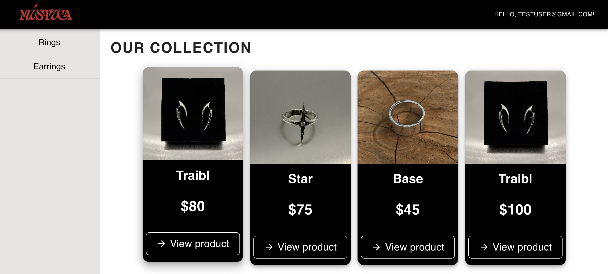

# Jewelry Shop

<p align="center">
  
</p>
Full-stack web application of a jewelry online store. The project allows users to browse products, view detailed information, and interact with the shopping cart. It also includes user authentication and role-based access (admin/user).

---

##  Tech Stack

### Frontend
- React
- Redux Toolkit
- Redux Saga
- MUI (Material UI)
- HTML, CSS, SCSS

### Backend
- Node.js
- Express
- MongoDB
- Mongoose

### Other
- REST API
- Google OAuth (authentication)
- CodeceptJS (testing)

---

## Features

### User
- Registration and login
- Authentication via Google
- Browse products
- View product details
- Add products to cart

### Admin
- Create, edit and delete products 
- Manage categories (in process)
- Role-based access control

### Access
Admin:
- Email: admin@gmail.com
- Password: admin1234

---

##  Authentication
- JWT-based authentication
- Google OAuth integration

---

## Getting Started

### 1. Clone the repository
```bash
git clone https://github.com/annieversaryyyyy/Shop.git
cd Shop

# Frontend
cd frontend
npm install
npm start

# Backend
cd shop-api
npm install
npm run seed //fixtures
npm run dev
